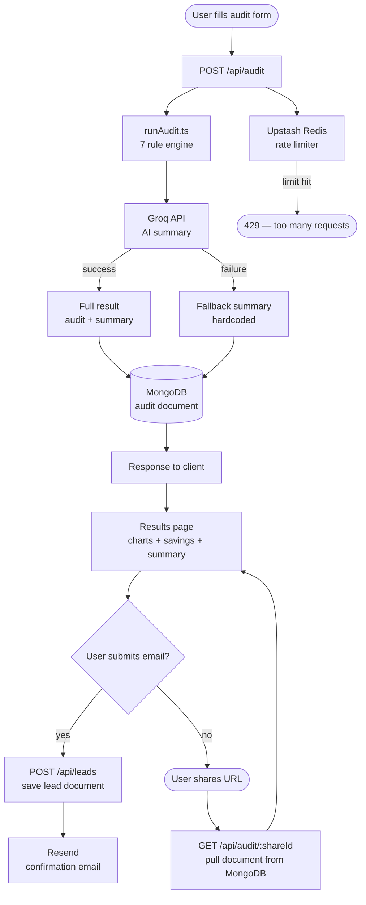

# Architecture

## System Diagram

---

## Stack Justification

**Next.js 14**
No headache of connecting frontend and backend separately it's all one
project. Also gets me CSR, SSR, and SSG out of the box (didn't end up using
SSG but it's there).

**TypeScript**
Type safety. Wanted to make sure there are no random bugs creeping in,
especially in the audit logic where the data shapes get complicated.

**Prisma**
Easy CRUD, clean schema definition, and I don't have to write raw database
queries everywhere. Just makes working with MongoDB less painful.

**MongoDB**
It's just good at storing JSON objects. The audit data is essentially a
nested JSON document so it fits naturally no weird relational gymnastics.

**Groq API**
Fast, free, and easy to integrate. That's honestly it.

**ioredis (for rate limiting)**
Only Redis client I've used before and I knew how to set it up. Easy to
integrate, does the job.

**Resend**
Easy to integrate and I get a free email for onboarding flows out of the box.
Didn't need anything more complex than that.
